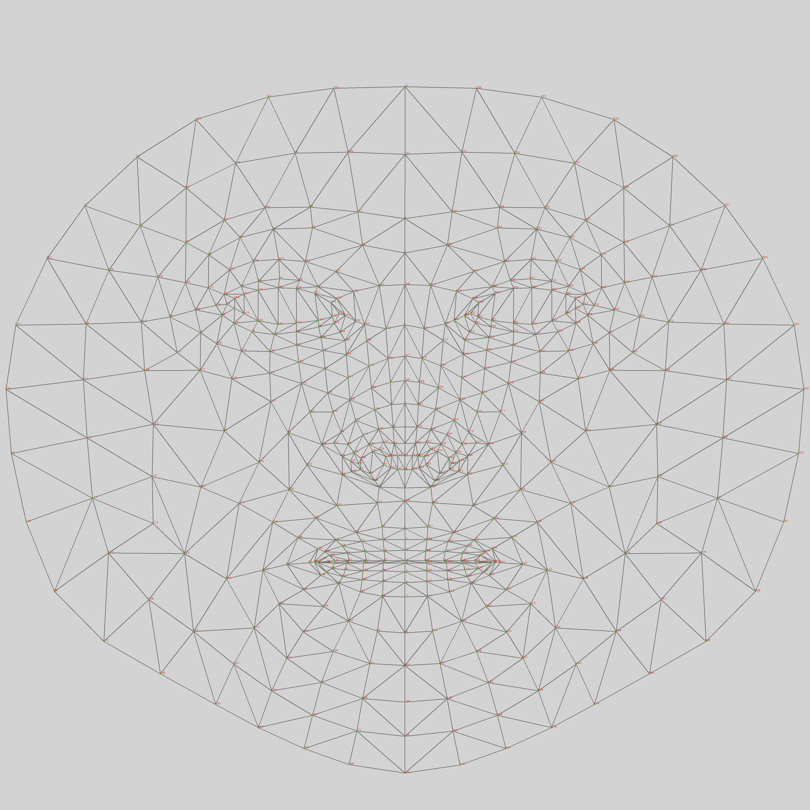
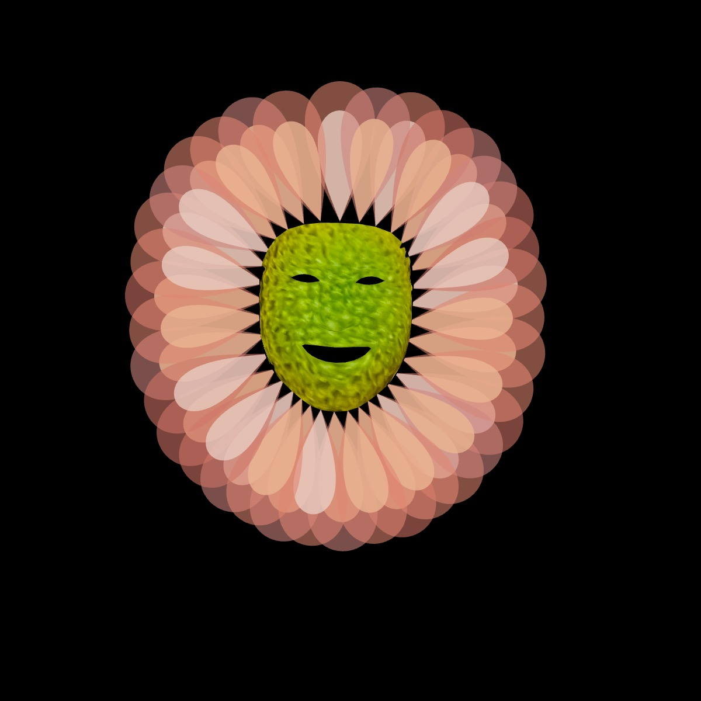

# ml5 FaceMesh Model

Daniel Shiffman recently released a [tutorial](https://thecodingtrain.com/tracks/ml5js-beginners-guide/ml5/facemesh) about the ml5 FaceMesh model. While it is possible to use the FaceMesh model in ways that are inappropriate or unethical, I have used it to create some **silly** visual effects.

## Ghost in the Material World

The first effect adapts some clever shader code from [Barney Codes](https://www.youtube.com/watch?v=ZcRptHYY3zM) to create a shockwave effect centered around the bounding box for the face.

First, we need to calculate the (centerX, centerY) to pass to the frag file. I have to confess that this was the hardest part. Adding the midpoint of the box width and height to the box xMax and yMax seems counter-intuitive (at least to me), but my guess is that is necessary because the video is flipped.

```JavaScript
let centerX = box.xMax + box.width / 2;
let centerY = box.yMax + box.height / 2;
```

We then use an adapted function from Barney Codes to update the "center" sent to the frag file in draw.

```JavaScript
function setCenter(cX, cY) {
  faceShader.setUniform("center", [cX / width, cY / height]);
}
```

Although this is certainly not necessary, I am using the [Craniod](https://mathworld.wolfram.com/Cranioid.html) function to create the "ghost" head.

```GLSL
vec2 Spherical(vec2 pos)
{
   float r = sqrt(pos.x*pos.x + pos.y*pos.y);
   float theta = atan(pos.y, pos.x);
   vec2 w = vec2(r, theta);
   return w;
}
float CraniodSDF(vec2 pos, vec2 radius) {
    vec2 q;
    float d = Spherical(pos).x;
    float theta = Spherical(pos).y;
    float r = 0.65 * sin(theta) +
        2.15 * sqrt(1.0 - 0.75 * pow(cos(theta), 2.0));

    q.x = radius.x * r * cos(theta);
    q.y = radius.y * r * sin(theta);

   return d -= length(q);
}
```

We are then using the shockwave function from Barney Codes to create a "ghostly" shockwave.

```GLSL
float shockwave(vec2 dir, float t) {
  float d = CraniodSDF(dir/aspect, vec2(t * maxRadius));
  d *= 1. - 0.9 * smoothstep(0., 0.05, abs(d)); // Mask the ripple
  d *= smoothstep(0., 0.05, t); // Smooth intro
  d *= 1. - smoothstep(0.5, 1., t); // Smooth outro
  return d;
}
```

<p align="center"></p>

## Pumpkin Face

To make the pumpkin face, I used the quadrilateral curve to render black triangles at the eyes and nose and used the [bicorn curve](https://mathcurve.com/courbes2d.gb/bicorne/bicorne.shtml) to add a mouth. I used the FaceMesh mesh map as a guide for the placement.

```JavaScript
function bicorn(r) {
  let points = [];
  for (let theta = 0; theta < TWO_PI; theta += 0.05) {
    let x = r * sin(theta);
    let y = (r * pow(cos(theta), 2)) / (2.3 + cos(theta));
    points.push(createVector(x, y));
  }
  return points;
}
```

<p align="center"></p>

It was a little tricky getting the eyes, nose, and mouth positioned so that there were no distortions added by the FaceMesh keypoints. Once I had the eyes, nose, and mouth positioned properly, I rendered them on top of a pumpkin image.

<p align="center"></p>

I then adapted the [FaceMesh texture sketch](https://editor.p5js.org/codingtrain/sketches/zUKp9n4MW) from Daniel Shiffman to render the image as a mask. The final touch was to add the pumpkin stem (with the background removed) at the top.

```JavaScript
let k = face.keypoints[10];
push();
translate(k.x - w / 2, k.y - w);
image(stem, 0, 0, w, w);
pop();
```

<p align="center"></p>

## Flower Face

<p align="center"></p>
